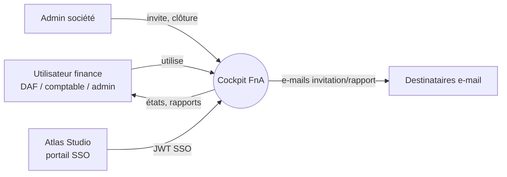
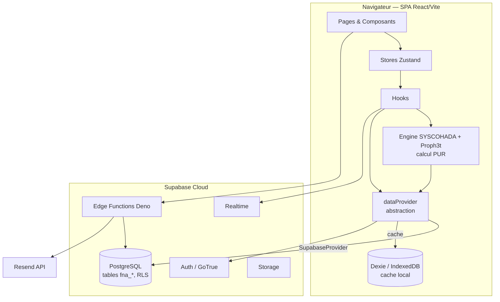
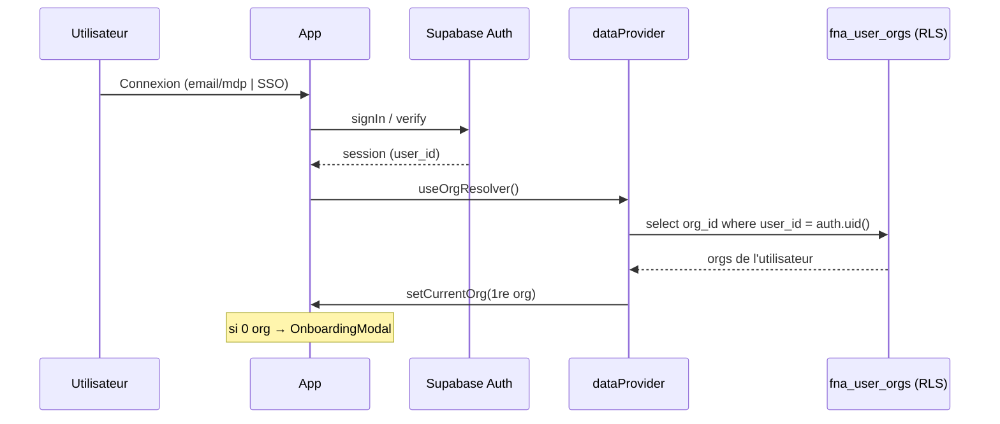
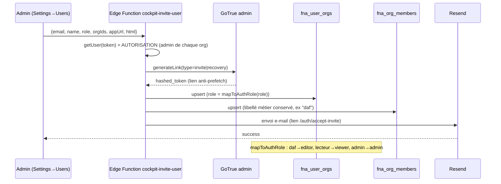
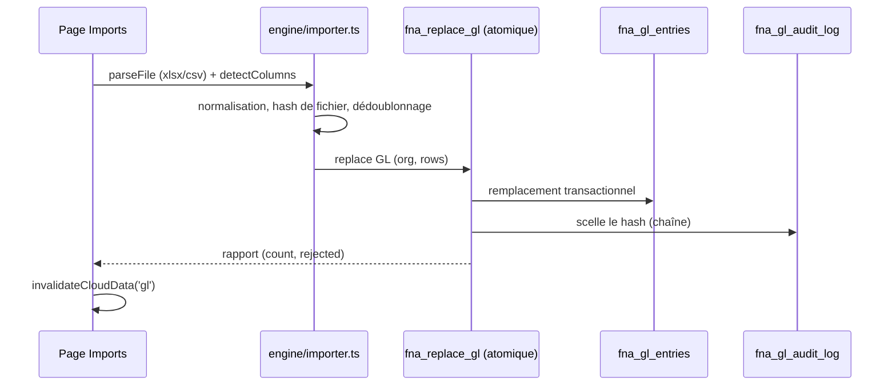
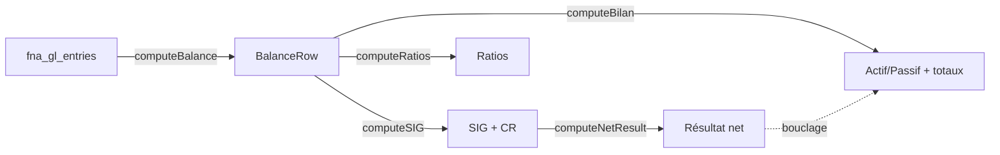
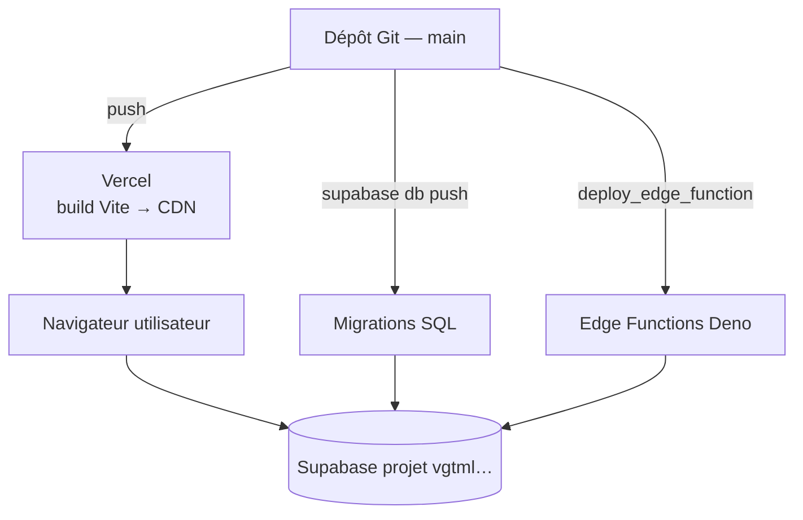
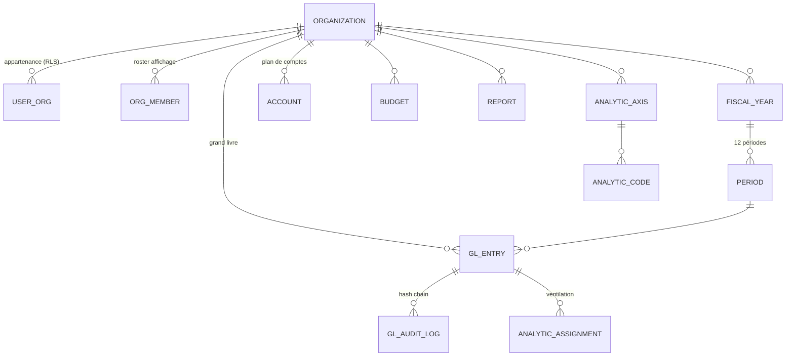

# Cockpit FnA — Documentation d'architecture logicielle

**Software Architecture Document (SAD)**
Structure : **arc42** · Modèle de vues : **C4** · Conforme à l'esprit **ISO/IEC/IEEE 42010** & **IEEE 1016**.

| | |
|---|---|
| **Produit** | Cockpit FnA — plateforme de pilotage financier OHADA/SYSCOHADA |
| **Version du document** | 2.1 |
| **Statut** | Baseline |
| **Audience** | Architectes, développeurs (humains & IA), DevOps, QA, sécurité, auditeurs |
| **Documents liés** | [`CLAUDE.md`](CLAUDE.md) · [`REPORTING_STANDARD.md`](REPORTING_STANDARD.md) |
| **Convention normative** | Mots-clés **DOIT / NE DOIT PAS / DEVRAIT / PEUT** au sens RFC 2119 |

---

## Table des matières

1. [Introduction et objectifs](#1-introduction-et-objectifs)
2. [Contraintes d'architecture](#2-contraintes-darchitecture)
3. [Contexte et périmètre du système](#3-contexte-et-périmètre-du-système)
4. [Stratégie de solution](#4-stratégie-de-solution)
5. [Vue des blocs de construction (C4)](#5-vue-des-blocs-de-construction-c4)
6. [Vue d'exécution (scénarios runtime)](#6-vue-dexécution-scénarios-runtime)
7. [Vue de déploiement](#7-vue-de-déploiement)
8. [Concepts transverses](#8-concepts-transverses)
9. [Décisions d'architecture (ADR)](#9-décisions-darchitecture-adr)
10. [Exigences qualité](#10-exigences-qualité)
11. [Risques et dette technique](#11-risques-et-dette-technique)
12. [Glossaire](#12-glossaire)
- [Annexe A — Dictionnaire de données (44 tables)](#annexe-a--dictionnaire-de-données)
- [Annexe B — Catalogue des fonctions serveur (RPC)](#annexe-b--catalogue-des-fonctions-serveur-rpc)
- [Annexe C — Carte des routes](#annexe-c--carte-des-routes)
- [Annexe D — Référence des modules moteur](#annexe-d--référence-des-modules-moteur)
- [Annexe E — Configuration & variables d'environnement](#annexe-e--configuration--variables-denvironnement)
- [Annexe F — Inventaire des migrations](#annexe-f--inventaire-des-migrations)
- [Annexe G — Politiques RLS, table par table](#annexe-g--politiques-rls-table-par-table)
- [Annexe H — Formules SIG & ratios (ligne à ligne)](#annexe-h--formules-sig--ratios-ligne-à-ligne)

---

## 1. Introduction et objectifs

### 1.1 Aperçu des exigences

Cockpit FnA est une application web **SaaS multi-tenant** de pilotage financier et comptable
conforme au référentiel **OHADA / SYSCOHADA révisé 2017** (zone UEMOA, devise XOF par défaut).
À partir d'un **Grand Livre** importé, le système produit :

- les **états financiers** légaux (Bilan, Compte de Résultat, SIG, TFT, TAFIRE, variation des
  capitaux propres) ;
- des **ratios** financiers et un **score de santé** (Z-Score Altman + score propriétaire) ;
- ~50 **dashboards** analytiques et sectoriels ;
- des **rapports** professionnels multi-format (PDF A4, PowerPoint) ;
- une **comptabilité analytique** (ventilation par axes, centres de coûts/profit) ;
- des **analyses assistées par IA** (Proph3t : anomalies, prédictions, commentaires d'expert) ;
- une **piste d'audit** inviolable (chaîne de hachage SHA-256).

### 1.2 Objectifs qualité (Quality Goals)

| # | Attribut qualité | Objectif | Priorité |
|---|---|---|---|
| Q1 | **Exactitude comptable** | Conformité stricte SYSCOHADA ; bouclage Bilan = CR garanti ; déterminisme monétaire | ⭐⭐⭐ |
| Q2 | **Isolation multi-tenant** | Aucune fuite inter-société ; RLS défense en profondeur | ⭐⭐⭐ |
| Q3 | **Intégrité & auditabilité** | Écritures scellées par chaîne de hachage ; traçabilité complète | ⭐⭐⭐ |
| Q4 | **Robustesse** | Dégradation gracieuse (offline, quota storage, session expirée) | ⭐⭐ |
| Q5 | **Performance de chargement** | Premier rendu léger ; libs lourdes différées par route/action | ⭐⭐ |
| Q6 | **Portabilité de la couche d'accès** | Commutation Supabase / démo / Electron sans toucher l'UI | ⭐⭐ |
| Q7 | **Maintenabilité** | Engine pur testé ; fichiers < 500 LOC ; conventions strictes | ⭐⭐ |

### 1.3 Parties prenantes (Stakeholders)

| Rôle | Attente vis-à-vis de l'architecture |
|---|---|
| Directeur financier / DAF / comptable (utilisateur) | États justes, imports simples, rapports exportables |
| Administrateur de société | Gestion des membres, rôles, clôtures de période |
| Développeur | Onboarding rapide, conventions claires, engine testable |
| DevOps | Déploiements reproductibles (front, migrations, Edge Functions) |
| RSSI / auditeur | RLS, secrets, piste d'audit, conformité |

---

## 2. Contraintes d'architecture

### 2.1 Contraintes techniques
- **Stack imposée** : React 18 + TypeScript strict + Vite 5 + Tailwind 3 ; Zustand ; Supabase.
- **Projet Supabase partagé** avec d'autres applications Atlas Studio → **isolation par préfixe
  `fna_*`** obligatoire ; interdiction absolue de modifier les objets non préfixés (autres apps).
- **Devise & référentiel** : XOF / SYSCOHADA révisé 2017 par défaut.
- **Navigateur** cible : evergreen ; support Safari iOS (contrainte `localStorage`).

### 2.2 Contraintes organisationnelles & conventions
- **Règles d'or** (cf. `CLAUDE.md`) : accès données via `dataProvider` uniquement ; `org_id`
  jamais codé en dur ; `safeLocalStorage` obligatoire ; tables backend préfixées `fna_*` ;
  fichiers de page < 500 LOC ; pas de `dangerouslySetInnerHTML` ; pas de `console.log` en `engine/`.
- **Format de commit** : `type(domaine): description` (feat/fix/refactor/perf/docs/chore).
- **Portes de qualité** avant commit : `typecheck` (0 err), `lint` (0 err), `test` (vert), `build` (OK).

---

## 3. Contexte et périmètre du système

### 3.1 Contexte métier (Business Context)



Le système reçoit un **Grand Livre** (import Excel/CSV) et des **paramètres société**, et restitue
états, dashboards, rapports et alertes.

### 3.2 Contexte technique (Technical Context) — interfaces externes

| Système externe | Rôle | Protocole / Interface |
|---|---|---|
| **Supabase** (Postgres, Auth, Realtime, Edge, Storage) | Persistance, authentification, temps réel | HTTPS / PostgREST / WebSocket ; clé anon (client), service-role (Edge only) |
| **Resend** | Envoi d'e-mails (invitations, rapports) | API REST (depuis Edge Functions) |
| **Sentry** | Monitoring d'erreurs + source maps « hidden » | SDK + upload build |
| **Atlas Error Monitor** | Console d'erreurs interne écosystème | HTTP |
| **Ollama** (optionnel) | LLM local pour Proph3t | HTTP localhost |
| **Atlas Studio SSO** | Authentification fédérée | JWT signé (app-token) |

---

## 4. Stratégie de solution

| Objectif qualité | Approche architecturale |
|---|---|
| Q1 Exactitude | **Engine pur** (aucune I/O) testé unitairement ; **source unique** `computeNetResult` pour le résultat net → bouclage Bilan = CR ; arithmétique **`Money`** déterministe (pas de flottants bruts) |
| Q2 Isolation | Filtrage `org_id` systématique **+** RLS Postgres via `fna_auth_org_ids()` ; écritures d'appartenance réservées à la service-role / RPC `SECURITY DEFINER` |
| Q3 Auditabilité | **Chaîne de hachage** SHA-256 par écriture ; RPC `fna_append_audit_log` scellée ; verrouillage de période |
| Q4 Robustesse | **Abstraction `dataProvider`** (fallback démo/local) ; `safeLocalStorage` ; erreurs RLS traduites |
| Q5 Performance | **Routes lazy** ; `manualChunks` vendors ; **imports dynamiques** des libs lourdes |
| Q6 Portabilité | Interface `DataProvider` unique + implémentations interchangeables |
| Q7 Maintenabilité | Séparation `pages` / `engine` / `hooks` ; conventions + portes CI |

---

## 5. Vue des blocs de construction (C4)

### 5.1 Niveau 1 — Diagramme de conteneurs (Container)



### 5.2 Niveau 2 — Décomposition interne

| Bloc | Répertoire | Responsabilité |
|---|---|---|
| **Présentation** | `src/pages/`, `src/components/` | Rendu, routage, interactions ; **aucun calcul métier** |
| **État** | `src/store/` | `app` (tenant/année/mode), `settings` (cibles), `theme` (palettes) |
| **Orchestration** | `src/hooks/` | Chargement mémoïsé, permissions, IA, realtime |
| **Domaine (Engine)** | `src/engine/` | Calculs SYSCOHADA + Proph3t (**purs**) |
| **Accès données** | `src/db/` | `dataProvider` + 5 implémentations + `schema.ts` |
| **Utilitaires** | `src/lib/` | `Money`, `format`, `safeStorage`, `supabase`, crypto, telemetry |
| **Référentiel** | `src/syscohada/` | Plan de comptes, règles, systèmes comptables |
| **Backend** | `supabase/` | Migrations SQL + Edge Functions |

### 5.3 Niveau 3 — Modules moteur clés

- **`statements.ts`** — `computeBilan()`, `computeSIG()` (Bilan/CR/SIG), `computeNetResult()`.
- **`balance.ts`** / `balanceAuxiliaire.ts` — balance générale & auxiliaires (agrégation racine SYSCOHADA).
- **`ratios.ts`** — `computeRatios()`, `computeVatRate()` (gardes ÷0, clamp TVA).
- **`budgetActual.ts`** / `monthly.ts` — Réalisé/Budget/N-1, mensualisation.
- **`analytical.ts`** / `analyticalEngine.ts` / `analyticBranch.ts` — comptabilité analytique.
- **`reportBlocks.ts`** — modèle par blocs + builders PDF/PPTX (cf. §12).
- **`glAudit.ts`** — contrôles de cohérence GL.
- **`proph3/*`** — intelligence, anomalies, prédictions, mémoire, commentateur.

Détail complet : **Annexe D**.

---

## 6. Vue d'exécution (scénarios runtime)

### 6.1 Résolution du tenant au login



### 6.2 Création de la première société (bootstrap anti catch-22)

```mermaid
sequenceDiagram
  participant UI as Settings / Onboarding
  participant RPC as fna_create_org_with_admin (SECURITY DEFINER)
  participant ORG as fna_organizations
  participant UO as fna_user_orgs
  UI->>RPC: rpc(p_id, p_name, sector, currency, coa, rccm, ifu)
  RPC->>RPC: vérifie auth.uid() ≠ null
  RPC->>ORG: INSERT ... ON CONFLICT DO NOTHING
  RPC->>RPC: GET DIAGNOSTICS row_count (garde anti-escalade)
  alt org déjà existante
    RPC-->>UI: EXCEPTION (refus)
  else org créée
    RPC->>UO: INSERT (auth.uid(), org, 'admin')
    RPC-->>UI: void (succès)
  end
  UI->>UI: upsertFiscalYear + 12 périodes ; toast succès
```

> Contourne le catch-22 : la policy RESTRICTIVE d'INSERT sur `fna_organizations` bloque un
> utilisateur sans org (aucun des prédicats `can_write_for_fna` / `service_role` /
> `fna_user_has_any_org` n'est vrai). La RPC `SECURITY DEFINER` contourne la RLS de façon contrôlée.

### 6.3 Invitation d'un utilisateur



L'invité : `/auth/accept-invite` → `verifyOtp(token_hash)` → session → définit mot de passe →
org résolue depuis `fna_user_orgs`.

### 6.4 Import du Grand Livre



### 6.5 Calcul des états (pipeline pur)



### 6.6 Génération d'un rapport

`Reports.tsx` → `ReportConfig` (blocs) → `buildPDFFromBlocks` (impression A4) **ou**
`buildPPTXFromBlocks` (pptxgenjs) → `saveAs`. Persistance : `JSON.stringify(config)` dans
`fna_reports.content`. (Détail : `REPORTING_STANDARD.md`.)

---

## 7. Vue de déploiement



| Artefact | Cible | Déclencheur | ⚠️ |
|---|---|---|---|
| Frontend (SPA) | Vercel (CDN) | `git push main` | auto-déploie |
| Migrations SQL | Supabase Postgres | commande Supabase séparée | **PAS** via git |
| Edge Functions | Supabase Deno | déploiement séparé | **PAS** via git |

**Environnements** : Preview (Vercel par PR) · Production. Secrets côté serveur en Edge Functions
uniquement. Source maps Sentry générées « hidden » puis supprimées de `dist/`.

---

## 8. Concepts transverses

### 8.1 Modèle de domaine (extrait)



### 8.2 Multi-tenant & sécurité RLS
Deux tables d'appartenance : **`fna_user_orgs`** (autoritaire, `role ∈ {admin,editor,viewer}`,
lue par la RLS) et **`fna_org_members`** (roster d'affichage, libellé métier libre).
Helpers `SECURITY DEFINER` : `fna_auth_org_ids(role)` (~78 policies), `can_write_for_fna()`,
`can_admin_for_fna()`, `fna_user_has_any_org()`, `fna_org_has_other_admin()`. Patron de policy :
lecture = tout membre, écriture = `editor/admin`. Bootstrap : `fna_create_org_with_admin`.

### 8.3 Déterminisme monétaire
`src/lib/Money.ts` + `moneySum.ts` (guide : `MONEY_GUIDE.md`) : toutes les agrégations financières
passent par une somme déterministe (évite les erreurs d'arrondi flottant sur des dizaines de
milliers de lignes). **NE JAMAIS** additionner des `number` bruts pour des montants.

### 8.4 Piste d'audit & intégrité
Chaîne de hachage SHA-256 par écriture GL (`lib/auditHash.ts`, `glAuditLog.ts`,
`engine/auditLog.ts`, table `fna_gl_audit_log` avec `audit_hash` + `previous_audit_hash`).
RPC serveur : `fna_append_audit_log(org, changes)`, `fna_get_last_audit_hash(org)`.
Verrouillage de période : `lib/periodLock.ts` + `fna_period_audit_log`.

### 8.5 Gestion des erreurs
- Provider : erreur RLS `42501` → message actionnable (« session expirée / reconnectez-vous »).
- UI : `ErrorBoundary` global + `toast` (succès/erreur) ; échecs de write **jamais silencieux**.
- Monitoring : Sentry (`lib/sentry.ts`) + Atlas Error Monitor (`lib/atlasErrorMonitor.ts`).

### 8.6 Persistance & synchronisation
Cloud (Supabase) source de vérité ; cache local Dexie (`supabaseSync.ts`) ; invalidation par tag
(`useCloudData` / `invalidateCloudData`). Realtime pour chat/activités/collaboration.

### 8.7 Internationalisation & format
Formatage FR (`lib/format.ts`) : `fmtMoney`, `fmtFull`, mode **Entier ↔ Abrégé** (`amountMode`).
Devise société paramétrable (`fna_organizations.currency`, défaut XOF).

### 8.8 Thème & accessibilité
Palettes pilotées par CSS custom properties (`--p-*`) injectées par `store/theme.ts` ; mode
clair/sombre (`darkMode: 'class'`). Police de base relevée (Dosis à `font-weight: 500`).

### 8.9 Mode démo
`org_id` en `demo-org-*` (`lib/demoMode.ts`) → `DemoProvider` **no-op** sur les writes ; données
`engine/demoSeed.ts` + `demoFixtures.ts`. **Toute fonctionnalité DOIT être testée avec ET sans démo.**

### 8.10 Intelligence (Proph3t)
Mémoire chiffrée (`fna_proph3_memory` / `fna_proph3_learning`, AES via `proph3Crypto.ts`) ;
prédictions par régression ; normes sectorielles ; LLM cloud + local (Ollama). Voir §13 doc précédente / Annexe D.

---

## 9. Décisions d'architecture (ADR)

| ADR | Décision | Statut | Justification / Conséquence |
|---|---|---|---|
| **ADR-01** | Abstraction `dataProvider` plutôt qu'appels Supabase directs | Accepté | Testabilité, mode démo, portabilité Electron. Contrainte : jamais `supabase.from()` en UI |
| **ADR-02** | Isolation par préfixe `fna_*` sur projet Supabase partagé | Accepté | Cohabitation multi-apps ; interdit de toucher les tables non préfixées |
| **ADR-03** | Résultat net via **source unique** `computeNetResult` | Accepté | Garantit le bouclage Bilan = CR quelles que soient les reclassements SIG |
| **ADR-04** | Arithmétique `Money` déterministe | Accepté | Évite dérives d'arrondi ; léger surcoût CPU accepté |
| **ADR-05** | Bootstrap d'org via RPC `SECURITY DEFINER` (vs INSERT client) | Accepté | Résout le catch-22 RLS sans ouvrir d'INSERT client ; garde anti-escalade |
| **ADR-06** | Lien d'invitation **anti-prefetch** (`token_hash` + `verifyOtp`) | Accepté | Neutralise les scanners e-mail qui « brûlaient » les liens |
| **ADR-07** | Rapports **par blocs** sérialisables (JSON) + builders purs | Accepté | Portabilité, multi-format, réutilisable (cf. `REPORTING_STANDARD.md`) |
| **ADR-08** | Routes **lazy** + libs lourdes en **import dynamique** | Accepté | Réduit le premier chargement ; complexité async assumée |
| **ADR-09** | Durcissement `SECURITY DEFINER` (révocation `anon` hors RLS) | Accepté | Défense en profondeur ; ne pas révoquer les helpers utilisés en RLS |

---

## 10. Exigences qualité

### 10.1 Arbre de qualité (Quality Tree)
```
Qualité
├── Exactitude (Q1)  ── Correctness ── Determinism
├── Sécurité (Q2,Q3) ── Tenant isolation ── Auditability ── Least privilege
├── Fiabilité (Q4)   ── Fault tolerance ── Graceful degradation
├── Performance (Q5) ── Load time ── Bundle size
└── Évolutivité (Q7) ── Modularity ── Testability
```

### 10.2 Scénarios qualité (échantillon)

| ID | Scénario | Réponse attendue |
|---|---|---|
| S1 | Un compte 706900 (RRR accordés) au débit est importé | Traité comme contre-produit ; CA net ; **pas** d'alerte d'anomalie |
| S2 | Utilisateur A ouvre une donnée de la société B | RLS refuse (0 ligne) ; aucune fuite |
| S3 | Session expirée pendant un write | Erreur 42501 traduite ; invite à se reconnecter |
| S4 | Utilisateur sans org clique « Créer une société » | RPC bootstrap crée org + admin ; succès |
| S5 | Invitation avec rôle « daf » | Mappé en `editor` ; accès effectif à la connexion |
| S6 | Ouverture de `/states` sans exporter | exceljs/pdf **non** chargés (import dynamique) |
| S7 | 50 000 écritures GL agrégées | Somme déterministe `Money` ; pas de dérive d'arrondi |

---

## 11. Risques et dette technique

| # | Risque / dette | Impact | Mitigation / recommandation |
|---|---|---|---|
| ~~R1~~ | ~~Deux conventions de tenant~~ | — | ✅ **RÉSOLU** (migration 027) : convergence `tenant_id uuid → org_id text` + policies standard sur les 14 tables concernées |
| R2 | **Trois librairies de graphes** (Recharts + Nivo + ECharts) | Poids bundle | Consolidation dédiée (chantier isolé) |
| R3 | Migrations **non re-jouables** à l'identique vs prod (objets appliqués à la main) | Reproductibilité | Capturer toute DDL prod en migration versionnée |
| R4 | Déploiement Edge Functions / migrations **hors git** | Écart code/prod | Pipeline CI dédié (Supabase CLI) |
| R5 | Chunks volumineux (`Dashboards`, `index`) | Perf 1er chargement de certaines routes | Découpe fine / préchargement ciblé |
| R6 | `fna_org_members.role` libre vs `fna_user_orgs.role` contraint | Incohérence d'accès (déjà survenue) | `mapToAuthRole` (fait) ; surveiller |

---

## 12. Glossaire

| Terme | Définition |
|---|---|
| **SYSCOHADA** | Système comptable OHADA (révisé 2017) — référentiel des états et du plan de comptes |
| **SIG** | Soldes Intermédiaires de Gestion (marge brute, VA, EBE, RE, RF, RHAO, RN) |
| **RRR** | Rabais, Remises, Ristournes ; **accordés** = contre-produits (comptes 709 / 70x9) |
| **HAO** | Hors Activités Ordinaires (produits 82/84/86/88 ; charges 81/83/85) |
| **TFT / TAFIRE** | Tableau des Flux de Trésorerie / Tableau Financier des Ressources & Emplois |
| **Org / tenant** | Société ; unité d'isolation multi-tenant (`org_id`) |
| **RLS** | Row-Level Security (Postgres) |
| **`SECURITY DEFINER`** | Fonction s'exécutant avec les privilèges de son propriétaire (contourne la RLS) |
| **Roster** | Annuaire d'affichage des membres (`fna_org_members`), indexé par email |
| **Proph3t** | Moteur d'intelligence propriétaire (anomalies, prédictions, commentaires) |
| **DSO / DPO / DIO** | Délais clients / fournisseurs / stocks (jours) |
| **`dataProvider`** | Couche d'accès abstraite (Supabase / Démo / Electron) |

---

## Annexe A — Dictionnaire de données

**44 tables `fna_*`** (schéma `public`). Légende : `*` = NOT NULL · `=…` = valeur par défaut.
✅ **Convention de tenant unifiée** (migration 027) : **toutes** les tables `fna_*` utilisent
désormais **`org_id text`** + policies RLS standard `fna_auth_org_ids()`. Les modules
allocation / capex / asset / inventory (anciennement `tenant_id uuid` + `get_user_company_id()`)
ont été convergés.

### A.1 Cœur multi-tenant & référentiel
| Table | Colonnes clés |
|---|---|
| `fna_organizations` | id* · name* · currency*(=XOF) · sector*(='') · accounting_system*(=Normal) · coa_system(=SYSCOHADA) · rccm · ifu · address · created_at* |
| `fna_user_orgs` | id*(uuid) · **user_id*(uuid)** · **org_id*** · **role***(=viewer, CHECK admin/editor/viewer) · created_at* |
| `fna_org_members` | id*(uuid) · org_id* · email* · name* · role*(=viewer, libre) · active*(=true) · invited_at* · invited_by · last_login_at |
| `fna_accounts` | org_id* · code* · label* · sysco_code · class* · type* |
| `fna_account_mappings` | org_id* · source_code* · target_code* |
| `fna_cr_models` | id* · org_id* · name* · is_default* · is_active* · sections/intermediates/formulas (jsonb) · version* · author |

### A.2 Comptabilité — exercices, périodes, Grand Livre
| Table | Colonnes clés |
|---|---|
| `fna_fiscal_years` | id* · org_id* · year* · start_date* · end_date* · closed* · status*(=open) · closed_at/by/reason |
| `fna_periods` | id* · org_id* · fiscal_year_id* · year* · month* · label* · closed* · status* · closed_at/by/reason |
| `fna_gl_entries` | id* · org_id* · period_id* · date* · journal* · piece* · account* · label* · debit*(=0) · credit*(=0) · tiers · analytical_axis · analytical_section · lettrage · import_id · hash · previous_hash |
| `fna_gl_tiers` | id* · org_id* · import_id · period_id · date* · account* · code_tiers* · label_tiers · debit* · credit* · journal · piece · category* |
| `fna_tiers_unmatched` | id* · org_id* · import_id · row_index* · date* · account* · code_tiers* · debit* · credit* · reason* · candidate_ids(array) · resolved_at/by/to · resolution |
| `fna_tiers_rules` | id* · org_id* · account* · label_contains · action* · tiers · tiers_label · reason · created_by |
| `fna_imports` | id* · org_id* · date* · user_name* · file_name* · file_hash · source* · kind* · year · version · count* · rejected* · status*(=success) · report · storage_path |

### A.3 Budget & analytique
| Table | Colonnes clés |
|---|---|
| `fna_budgets` | id* · org_id* · year* · version*(=V1) · account* · month* · amount*(=0) · analytical_axis · analytical_section |
| `fna_analytic_axes` | id* · org_id* · number* · code · label · active* · name · code_name · required* |
| `fna_analytic_codes` | id* · org_id* · axis_id* · code* · label · parent_id · active* · branch · short/long_label · sort_order* |
| `fna_analytic_rules` | id* · org_id* · priority* · active* · conditions/assignments(jsonb) · condition_type/value · target_axis · analytic_code_id |
| `fna_analytic_assignments` | id* · org_id* · gl_entry_id* · axis_number* · code_id* · branch · method · rule_id · assigned_at |
| `fna_analytic_budgets` | id* · org_id* · code_id* · period* · amount*(=0) |

### A.4 Ventilation analytique (allocation) — `org_id text` (convergé, migr. 027)
| Table | Rôle |
|---|---|
| `fna_allocation_key` | Clés de répartition (code, libellé, unité, actif) |
| `fna_allocation_key_value` | Valeurs de clé par section |
| `fna_allocation_rule` | Règles de ventilation (DIRECT/…, patterns compte/journal/libellé/tiers, ordre) |
| `fna_allocation_run` | Exécutions (exercice, couverture %, montants GL/ventilé, réconcilié, hash audit) |
| `fna_secondary_transfer` | Transferts secondaires entre sections |

### A.5 Immobilisations & inventaire physique — `org_id text` (convergé, migr. 027)
| Table | Rôle |
|---|---|
| `fna_asset_disposal` | Cessions d'immobilisations (type, date, valeur, VNC, +/- value, écriture liée) |
| `fna_asset_maintenance` | Maintenance (préventive/…, planif, coût, technicien, statut) |
| `fna_inventory_session` | Sessions de comptage (période, responsable, statut) |
| `fna_inventory_count` | Lignes de comptage (statut, localisation réelle, résolution) |

### A.6 CAPEX (workflow d'investissement) — `org_id text` (convergé, migr. 027)
| Table | Rôle |
|---|---|
| `fna_capex_approval` | Circuit d'approbation (niveau, rôle, statut, décideur, hash) |
| `fna_capex_approval_matrix` | Matrice de seuils → niveau/rôle requis |
| `fna_capex_note` | Notes/pièces jointes d'une demande |
| `fna_capex_pir` | Post-Implementation Review (coût final, écart budget, VAN ex-post, leçons) |
| `fna_car` | Capital Appropriation Request (référence, montant, justification, statut) |

### A.7 Pilotage — attention & plans d'action
| Table | Colonnes clés |
|---|---|
| `fna_attention_points` | severity/probability/category · source · owner · target_resolution_date · estimated_financial_impact · root_cause · recommendation · tags · status · journal |
| `fna_action_plans` | attention_point_id · title · owner · team · sponsor · dates · priority · status · progress · budget_allocated · deliverables · success_criteria · dependencies · blockers |

### A.8 Reporting & collaboration
| Table | Colonnes clés |
|---|---|
| `fna_reports` | id* · org_id* · title* · type* · author* · status*(=draft) · content (JSON ReportConfig) |
| `fna_report_templates` | id* · org_id* · name* · description · config*(=`{}`) |
| `fna_channels` | id* · org_id* · kind* · name* · members(jsonb) · created_by* · is_pinned |
| `fna_chat_messages` | id* · org_id* · channel_id* · user_id* · content* · mentions/reactions/attachment(jsonb) · reply_to · read_by |
| `fna_activities` | id* · org_id* · kind* · status* · context · author_id/name* · content* · metadata · resolved_at/by |

### A.9 Audit & IA
| Table | Colonnes clés |
|---|---|
| `fna_gl_audit_log` | id* · org_id* · gl_entry_id* · changed_at* · changed_by · field* · old/new_value · reason* · **audit_hash*** · **previous_audit_hash*** |
| `fna_period_audit_log` | id* · org_id* · period_id · fiscal_year_id · action* · reason · user_id/email |
| `fna_proph3_memory` | org_id* · data(jsonb) · **data_encrypted** · iv · updated_at* |
| `fna_proph3_learning` | org_id* · data(jsonb) · **data_encrypted** · iv · updated_at* |

---

## Annexe B — Catalogue des fonctions serveur (RPC)

Toutes en `SECURITY DEFINER` sauf trigger. Schéma `public`.

| Fonction | Signature | Retour | Rôle |
|---|---|---|---|
| `fna_create_org_with_admin` | `(p_id text, p_name text, p_sector text, p_currency text, p_coa_system text, p_rccm text, p_ifu text)` | void | Bootstrap org + mapping admin (anti catch-22, garde anti-escalade) |
| `fna_auth_org_ids` | `(required_role text)` | setof text | Org_ids du user courant (helper RLS, ~78 policies) |
| `can_write_for_fna` | `()` | bool | Entitlement écriture applicatif |
| `can_admin_for_fna` | `()` | bool | Entitlement admin applicatif |
| `fna_user_has_any_org` | `()` | bool | L'utilisateur a-t-il ≥ 1 org (fallback bootstrap) |
| `fna_org_has_other_admin` | `(p_org_id text, p_user uuid)` | bool | Garde « ne pas retirer le dernier admin » |
| `fna_append_audit_log` | `(p_org_id text, p_changes jsonb)` | int | Ajoute un maillon scellé à la chaîne d'audit |
| `fna_get_last_audit_hash` | `(p_org_id text)` | text | Dernier hash de la chaîne (exec `anon` révoquée) |
| `fna_import_tiers` | `(p_org_id, p_user, p_file_name, p_source, p_count, p_rejected, p_status, p_report, p_enriched jsonb, p_unmatched jsonb, p_file_hash)` | jsonb | Import atomique GL Tiers |
| `fna_proph3_set_updated_at` | `()` | trigger | Horodatage mémoire Proph3t |
| `fna_replace_gl` | *(RPC d'import GL atomique — cf. migration 022)* | — | Remplacement transactionnel du Grand Livre |

---

## Annexe C — Carte des routes

**Publiques** : `/` (Landing) · `/demo` · `/login` · `/signup` · `/forgot-password` ·
`/reset-password` · `/auth/callback` · `/auth/accept-invite` · `/auth` (SSO Atlas).

**Protégées (ProtectedRoute + AppLayout)** :
- **Accueil / synthèse** : `/home` · `/dashboards` · `/dashboard/home` (SyntheseHub)
- **Données** : `/imports` · `/grand-livre` · `/balance` · `/coa` · `/states` · `/ratios` · `/budget`
- **Analytique** : `/analytical/{coverage,cost-centers,revenue-centers,resources,overhead,fg-allocation,journal,balance,pivot,anomalies,audit-trail,kpis}` · `/import-analytical`
- **Dashboards dédiés** : `/dashboard/{exec,compliance,breakeven,pareto,cashforecast,waterfall,chart-gallery,tft-monthly,capital-variation,closing-pack,zscore,forecast,wcd,tafire,bilan-monthly,caf,multi-year,bank-reconciliation,closing-justification,audit-trail,anomalies,lettrage,seasonality,whatif,provisions,intercos,weekly,mda,board-pack,sector-benchmark,proph3t}` · `/dashboard/:id`
- **Reporting & IA** : `/reports` · `/cr-editor` · `/builder`(+`/:id`) · `/ai` · `/chat`
- **Paramètres & audit** : `/settings` · `/settings/team` · `/audit` · `/guide` · `/actions`

Toutes lazy (`lazyWithRetry`) sauf `Home`.

---

## Annexe D — Référence des modules moteur

`src/engine/` (calcul pur) :

| Module | Exports notables |
|---|---|
| `statements.ts` | `computeBilan`, `computeSIG`, `computeNetResult`, types `Line`, `SIG` |
| `balance.ts` | `computeBalance`, `computeAuxBalance`, `aggregateBySyscoRoot`, `BalanceRow` |
| `balanceAuxiliaire.ts` | Balances auxiliaires clients/fournisseurs |
| `ratios.ts` | `computeRatios`, `computeVatRate`, type `Ratio` |
| `budget.ts` / `budgetActual.ts` | Budgets, écarts Réalisé/Budget/N-1 |
| `monthly.ts` | Agrégats mensuels (CR/Bilan) |
| `analytical.ts` / `analyticalEngine.ts` | `computeAnalyticalPL`, CRUD axes/codes/règles |
| `analyticBranch.ts` | `inferBranch` (revenue/project_cost/overhead) |
| `analyticDashboards.ts` | `loadAnalyticContext`, `viewEntries` |
| `analytics.ts` | `agedBalance`, `tresorerieMonthly`, séries temporelles |
| `glAudit.ts` | Contrôles de cohérence GL (sens des classes, écritures anormales) |
| `auditLog.ts` | Journalisation scellée (hash) |
| `reportBlocks.ts` | Modèle par blocs + `buildPDFFromBlocks` / `buildPPTXFromBlocks` |
| `reportBuilder.ts` | Rapport PDF multi-sections (couverture/sommaire/pagination) |
| `exporter.ts` | `exportStatementsXLSX` / `exportStatementsPDF` (imports dynamiques) |
| `importer.ts` | `parseFile`, `importGL`, `importGLTiers`, `detectColumns`, `computeFileHash` |
| `templates.ts` | Génération de modèles Excel (GL, balance, tiers, COA, analytique, budget) |
| `currency.ts` / `accountingSystems.ts` / `crModels.ts` | Devises, systèmes, modèles de CR |
| `tiersCategory.ts` / `tiersRules.ts` | Catégorisation & règles de tiers |
| `hungarian.ts` | Algorithme hongrois (affectation optimale — lettrage/rapprochement) |
| `flows.ts` / `synthese.ts` | Flux de trésorerie, synthèses |
| `demoSeed.ts` / `demoFixtures.ts` | Données de démonstration |

`src/engine/proph3/` (IA) : `intelligence.ts`, `anomalies.ts`, `predictions.ts`, `memory.ts`,
`learning.ts`, `commentator.ts`, `reportCommentator.ts`, `scoring.ts`, `benchmark.ts`,
`syscohada-knowledge.ts`, `knowledge/`, `ollama.ts`.

---

## Annexe E — Configuration & variables d'environnement

| Variable | Portée | Rôle |
|---|---|---|
| `VITE_SUPABASE_URL` | Client | URL du projet Supabase |
| `VITE_SUPABASE_ANON_KEY` | Client | Clé publique anon (soumise à la RLS) |
| `SUPABASE_SERVICE_ROLE_KEY` | **Edge only** | Contourne la RLS — **jamais** côté client |
| `RESEND_API_KEY` / `RESEND_FROM_COCKPIT` | Edge | Envoi d'e-mails |
| `SENTRY_AUTH_TOKEN` / `SENTRY_ORG` / `SENTRY_PROJECT` / `SENTRY_URL` | CI/build | Upload source maps (sinon no-op) |

Build (`vite.config.ts`) : `manualChunks` (vendor-react/recharts/echarts/nivo/xlsx/exceljs/pdf/pptx/db/utils),
source maps « hidden » si Sentry actif, `chunkSizeWarningLimit: 1200`.
Scripts : `npm run typecheck | lint | test | build`.

---

## Annexe F — Inventaire des migrations

`supabase/migrations/` — 27 fichiers (001 → 026). Jalons :

| # | Objet |
|---|---|
| 001–011 | Schéma initial : organisations, exercices/périodes, comptes, GL, imports, budgets, reports/templates, attention/actions, analytics, email, audit trail + verrou période |
| 012 | **Production-ready** : renommage `fna_*`, `fna_org_members`, RLS |
| 013–015 | Correctifs RLS bootstrap (self-admin insert, récursion, fallback RESTRICTIVE) |
| 016–017 | Tiers non appariés + RPC import tiers |
| 018 | Plan de comptes par org |
| 019–020 | Journal d'audit GL + RPC append |
| 021 | FK GL→imports (cascade) · règles tiers |
| 022 | Remplacement GL atomique (`fna_replace_gl`) |
| 023 | GL Tiers |
| 024 | Contrainte unicité dédup budget |
| 025 | **Durcissement** `SECURITY DEFINER` (révocation `anon` hors RLS) |
| 026 | **RPC `fna_create_org_with_admin`** (bootstrap 1re org) |
| 027 | **Convergence tenant** : `tenant_id uuid → org_id text` + policies standard (14 tables) |

---

## Annexe G — Politiques RLS, table par table

### G.1 Modèle de sécurité (deux couches)

Chaque table `fna_*` a la **RLS activée**. Une requête passe si :

> **(au moins une policy PERMISSIVE vraie) ET (toutes les policies RESTRICTIVE vraies)**

- **Couche PERMISSIVE** (accès nominal, par `org_id`) — abréviations :
  - `MEMBRE` ≡ `org_id IN (SELECT fna_auth_org_ids())` — tout membre de l'org
  - `EDITOR` ≡ `org_id IN (SELECT fna_auth_org_ids('editor'))` — editor **ou** admin
  - `ADMIN`  ≡ `org_id IN (SELECT fna_auth_org_ids('admin'))` — admin uniquement
- **Couche RESTRICTIVE** (garde d'entitlement, défense en profondeur) :
  - `G_WRITE` ≡ `can_write_for_fna() OR auth.role()='service_role' OR EXISTS(fna_user_orgs WHERE user_id=auth.uid() AND role IN ('admin','editor'))`
  - `G_ADMIN` ≡ `can_admin_for_fna() OR service_role OR EXISTS(… role='admin')`

`fna_auth_org_ids()`, `can_write_for_fna()`, etc. sont `SECURITY DEFINER` (cf. Annexe B).

### G.2 Profil standard (appliqué à la majorité des tables)

| Opération | Condition effective |
|---|---|
| SELECT | `MEMBRE` |
| INSERT | `EDITOR` ∧ `G_WRITE` |
| UPDATE | `EDITOR` ∧ `G_WRITE` |
| DELETE | `EDITOR` ∧ `G_ADMIN` (⇒ **admin** en pratique) |

**Tables au profil standard** : `fna_accounts`, `fna_account_mappings`, `fna_action_plans`,
`fna_analytic_assignments`, `fna_analytic_axes`, `fna_analytic_budgets`, `fna_analytic_codes`,
`fna_analytic_rules`, `fna_attention_points`, `fna_budgets`, `fna_cr_models`, `fna_fiscal_years`,
`fna_imports`, `fna_periods`, `fna_report_templates`, `fna_reports`, `fna_proph3_memory`,
`fna_proph3_learning`.

### G.3 Tables au profil spécifique

| Table | SELECT | INSERT | UPDATE | DELETE | Particularité |
|---|---|---|---|---|---|
| **`fna_organizations`** | `id∈MEMBRE` | `TRUE` (perm.) ∧ `G_WRITE OR fna_user_has_any_org()` | `id∈ADMIN` ∧ `G_WRITE(editor)` | `G_ADMIN OR id∈ADMIN` | INSERT permissif `true` **encadré** par la garde restrictive → bootstrap 1re org via RPC (§6.2) |
| **`fna_user_orgs`** | `user_id = auth.uid()` (**ses lignes seulement**) | `fna_uo_self_admin_insert` : `user_id=uid AND role='admin' AND NOT fna_org_has_other_admin(org,uid)` ∧ `G_WRITE(self-admin)` | `G_ADMIN` | `G_ADMIN` | Écriture réservée service-role / RPC ; self-admin seulement si aucun autre admin |
| **`fna_org_members`** | `MEMBRE` | `ADMIN` (via `_all`) ∧ `G_WRITE` | `ADMIN` ∧ `G_WRITE` | `ADMIN` ∧ `G_ADMIN` | Gestion réservée aux admins ; roster d'affichage |
| **`fna_gl_entries`** | `MEMBRE` | `EDITOR` **ET période non `closed`/`archived`** ∧ `G_WRITE` | `EDITOR` ∧ `G_WRITE` | `EDITOR` **ET période non verrouillée** ∧ `G_ADMIN` | **Verrou de période** intégré à la policy |
| **`fna_gl_tiers`** | `MEMBRE` | `EDITOR` ∧ `G_WRITE(editor)` | `EDITOR` ∧ `G_WRITE(editor)` | `EDITOR` ∧ `G_WRITE(editor)` | Garde restrictive à base d'`org_id` (pas d'EXISTS) |
| **`fna_tiers_rules`** | `MEMBRE` | `EDITOR` | `EDITOR` | `EDITOR` | idem tiers |
| **`fna_tiers_unmatched`** | `MEMBRE` | `EDITOR` | `EDITOR` | `EDITOR` | idem tiers |
| **`fna_gl_audit_log`** | `MEMBRE` | `EDITOR` | — | — | **Immuable** : pas d'UPDATE/DELETE (intégrité de la piste d'audit) |
| **`fna_period_audit_log`** | `MEMBRE` | `ADMIN` ∧ `G_WRITE` | (restrictive) | `G_ADMIN` | Journal de clôture réservé admin |
| **`fna_channels`** | `MEMBRE` | `MEMBRE` ∧ `G_WRITE` | `MEMBRE` ∧ `G_WRITE` | `MEMBRE` ∧ `G_ADMIN` | **Collaboration** : écriture par tout membre |
| **`fna_chat_messages`** | `MEMBRE` | `MEMBRE` ∧ `G_WRITE` | `MEMBRE` ∧ `G_WRITE` | `MEMBRE` ∧ `G_ADMIN` | idem collaboration |
| **`fna_activities`** | `MEMBRE` | `MEMBRE` ∧ `G_WRITE` | `MEMBRE` ∧ `G_WRITE` | `MEMBRE` ∧ `G_ADMIN` | idem collaboration |
| **Tables convergées** (migr. 027) : `fna_allocation_*`, `fna_asset_*`, `fna_capex_*`, `fna_car`, `fna_inventory_*`, `fna_secondary_transfer` | `MEMBRE` | `EDITOR` | `EDITOR` | `ADMIN` | Policies `_org_sel/_ins/_upd/_del` (100 % PERMISSIVE, sans garde restrictive) |

> **Note d'audit** : la policy PERMISSIVE INSERT `fna_org_insert` (`WITH CHECK true`) sur
> `fna_organizations` est **neutralisée** par la policy RESTRICTIVE compagnon — ce n'est **pas** une
> faille (cf. advisor « rls_policy_always_true », mitigé).

---

## Annexe H — Formules SIG & ratios (ligne à ligne)

Source : `src/engine/statements.ts` (`computeSIG`) & `src/engine/ratios.ts` (`computeRatios`).
**Notation** : `ΣC(p…)` = somme des **soldes créditeurs** des comptes de préfixe `p` ;
`ΣD(p…)` = soldes **débiteurs** ; `net(p…)` = `ΣD − ΣC` (solde net débiteur).
Toutes les sommes sont **déterministes** (`Money`, cf. §8.3).

### H.1 Produits & charges d'exploitation

| Agrégat | Formule (comptes SYSCOHADA) |
|---|---|
| Ventes de marchandises | `venteMarch = ΣC(701) hors 7019` |
| Ventes de produits/services | `venteProd = ΣC(702,703,704,705,706,707) hors 70x9` |
| **RRR accordés** (contre-produits) | `rrr709 = net(709)` · `rrrMarchD = net(7019)` · `rrrProdD = net(7029,7039,7049,7059,7069,7079)` · `rrrAccordes = rrr709 + rrrMarchD + rrrProdD` |
| **Chiffre d'affaires (net)** | `CA = venteMarch + venteProd + ΣC(708) − rrrAccordes` |
| Production stockée | `prodStockee = ΣC(73) − ΣD(73)` |
| Production immobilisée | `prodImmob = ΣC(72)` |
| Subventions d'exploitation | `subvExpl = ΣC(71)` |
| Autres produits | `autresProd = ΣC(75,78) − ΣD(75,78)` |
| Achats de marchandises | `achatMarch = net(601)` · `varStockMarch = net(6031)` |
| Achats MP & fournitures | `achatMP = net(602)+net(604)+net(605)+net(608)` · `varStockMP = net(6032,6033)` |
| Transports | `transport = net(61)` |
| Services extérieurs | `servExt = net(62,63)` |
| Impôts et taxes | `impotsTaxes = net(64)` |
| Autres charges | `autresCharges = net(65)` |
| Charges de personnel | `personnel = net(66)` |
| Dotations (répartition) | `dotFin = net(686,696)` · `dotHAO = net(687,697)` · `dotExpl = net(68,69) − dotFin − dotHAO` · `dotations = dotExpl − (ΣC(79) − ΣD(79))` |

### H.2 Soldes intermédiaires de gestion (SIG)

Répartition des RRR pour la marge (invariant `rrrMarch + rrrProd = rrrAccordes`) :
`totalVentesBrut = venteMarch + venteProd` ·
`rrrMarch = rrrMarchD + rrr709 × (venteMarch / totalVentesBrut)` ·
`rrrProd = rrrProdD + rrr709 × (venteProd / totalVentesBrut)`

| Solde | Formule |
|---|---|
| Marge sur marchandises | `margeMarch = (venteMarch − rrrMarch) − (achatMarch + varStockMarch)` |
| Marge sur matières | `margeMP = (venteProd − rrrProd) + prodStockee − (achatMP + varStockMP)` |
| **Marge brute** | `margeBrute = margeMarch + margeMP` |
| **Valeur ajoutée** | `VA = margeBrute + prodImmob + subvExpl + autresProd − transport − servExt − impotsTaxes − autresCharges` |
| **EBE** | `ebe = VA − personnel` |
| **Résultat d'exploitation** | `re = ebe − dotations` |
| Résultat financier | `prodFin = ΣC(77)−ΣD(77)` · `chargeFin = net(67) + dotFin` · `rf = prodFin − chargeFin` |
| Résultat HAO | `prodHAO = ΣC(82,84,86,88)−ΣD(…)` · `chargeHAO = net(81,83,85) + dotHAO` · `rhao = prodHAO − chargeHAO` |
| Résultat des activités ordinaires | `rao = re + rf` |
| Participation / Impôt | `participation = net(87)` · `impot = net(89)` |
| **Résultat net** | `resultat = computeNetResult(rows)` — **source unique** (Σ produits − Σ charges) ⇒ bouclage Bilan = CR ; algébriquement = `rao + rhao − participation − impot` |

### H.3 Ratios financiers

Fonctions robustes : `pct(n,d) = (d≠0 ∧ fini) ? n/d×100 : NaN` · `ratioVal(n,d) = (d≠0 ∧ fini) ? n/d : NaN`.
Postes de bilan : `capPropres(_CP)`, `ressStables(_DF)`, `actifImmo(_AZ)`, `stocks(BB)`,
`creancesClients(BH)`, `autresCreances(BI)`, `tresoActive(_BT)`, `actifCirc(_BK)`, `passifCirc(_DP)`,
`tresoPass(DV)`, `dettesFin(DA)`, `dettesFourn(DJ)`.

| Code | Libellé | Formule | Unité | Cible | Sens |
|---|---|---|---|---|---|
| MB | Taux de marge brute | `pct(margeBrute, CA)` | % | 30 | ↑ |
| TVA | Taux de valeur ajoutée | `pct(VA, CA)` | % | 35 | ↑ |
| EBE | Taux d'EBE | `pct(ebe, CA)` | % | 15 | ↑ |
| TRE | Rentabilité d'exploitation | `pct(re, CA)` | % | 10 | ↑ |
| TRN | Rentabilité nette | `pct(resultat, CA)` | % | 8 | ↑ |
| ROE | Rentabilité des CP | `roeDenom>0 ? pct(resultat, roeDenom) : NaN` ; `roeDenom = (CP_N-1 + CP)/2` **ou** `CP − resultat` | % | 12 | ↑ |
| ROA | Rentabilité de l'actif | `roaDenom>0 ? pct(resultat, roaDenom) : NaN` ; `roaDenom = (Actif_N-1 + Actif)/2` **ou** `Actif − resultat` | % | 6 | ↑ |
| LG | Liquidité générale | `ratioVal(actifCirc + tresoActive, passifCirc + tresoPass)` | × | 1.5 | ↑ |
| LR | Liquidité réduite | `ratioVal(actifCirc + tresoActive − stocks, passifCirc + tresoPass)` | × | 1.0 | ↑ |
| LI | Liquidité immédiate | `ratioVal(tresoActive, passifCirc + tresoPass)` | × | 0.3 | ↑ |
| AF | Autonomie financière | `ratioVal(capPropres, totalActif)` | ratio | 0.5 | ↑ |
| END | Endettement | `ratioVal(dettesFin, capPropres)` | ratio | 1.0 | ↓ |
| CAP_REMB | Capacité de remboursement | `caf>0 ? ratioVal(dettesFin, caf) : NaN` | × | 4 | ↓ |
| FR | Fonds de roulement | `ressStables − actifImmo` (bon si ≥ 0) | montant | 0 | — |
| BFR | Besoin en FR | `stocks + creancesClients + autresCreances − passifCirc` | montant | 0 | — |
| TN | Trésorerie nette | `tresoActive − tresoPass` (bon si ≥ 0) | montant | 0 | — |
| DSO | Délai clients | `caTTC>0 ? (creancesClients / caTTC) × periodDays : NaN` | j | 60 | ↓ |
| DPO | Délai fournisseurs | `achatsTTC>0 ? (dettesFourn / achatsTTC) × periodDays : NaN` | j | 60 | ↑ |

**TVA & TTC** (pour DSO/DPO) : `tauxTvaSortie = clamp(ΣC(443)−ΣD(443)) / CA, [0 %, 30 %], fallback 18 %)` ;
`caTTC = CA × (1 + tauxTvaSortie)`. Côté achats : `achatsHT = net(60) hors 603` ;
`tauxTvaEntree = clamp(net(445)/achatsHT, [0 %,30 %], fallback 18 %)` ; `achatsTTC = achatsHT × (1 + tauxTvaEntree)`.
`periodDays` défaut = 360.

**CAF** (méthode additive) : `caf = resultat + dotN − repN` ; `dotN = net(68,69)` ;
`repN = ΣC(78,79) − ΣD(78,79)`.

---

*Fin du document. Toute évolution structurante DOIT incrémenter la version en en-tête et être
répercutée dans `CLAUDE.md`. Ce document adopte la structure arc42 ; les diagrammes sont en
syntaxe Mermaid (rendus par GitHub / IDE compatibles).*
